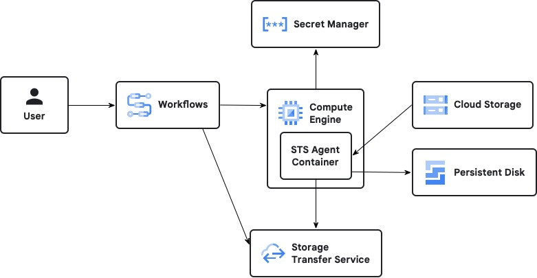

# Deploying a Cloud Storage to Persistent Disk hydrator service

This solution deploys Workflows service that can be run to hydrate (copy)
objects from a Cloud Storage bucket to a persistent disk (PD). This can be
useful in accelerating AI/ML workloads with Hyperdisk ML persistent disks.

Hydrating requires attaching and mounting a PD on a Compute Engine instance and
then transferring the objects from Cloud Storage to the PD's mount point. This
solution simplifies this process by leveraging

- Storage Transfer Service (STS) - A fully managed object and file transfer
service. Used to transfer objects from Cloud Storage to the PD.
- Storage Transfer Service Agent - An STS container application that runs on a
Compute Engine instance and coordinates with STS to write objects to a locally
attached filesystem
- Workflows - A managed orchestration platform used instantiate the STS Agent,
initiate the STS Transfer, and monitor its status.
- Secrets Manager - A secrets and credential management service. Used to
securely hold a Service Accounts private key to be used by the STS Agent.

The following picture shows the architecture of the solution.

## Architecture



## Operation

The service is invoked by running the 'hydrate' workflow. This can be done via
the Workflows API or the `gcloud workflows` CLI. The hydrate workflow expects
the following arguments:

- `bucket`: Name of Source Bucket to copy from.
- `bucket_path`: Root path to transfer objects from. Used an object prefix and
must end with a '/'. Use the empty string to transfer all objects found in the
bucket.
- `pd_name`: Name of the persistent disk to hydrate. It must already be created.
If the PD isn't formatted it will be.
- `pd_path`: Path to copy the files to within the PD. Empty or '/' is the root
directory of the PD.
- `zone`: Zone where the PD was created.

The workflow then performs the following steps:

1. Validates the PD is "READY" and not already attached to an instance.
2. Creates an STS Agent Pool that the STS Agent register with for transfer
coordination
3. Creates a Compute Engine instance in the PD's Zone using a customized
instance template. The templates cloud-init startup script is configured to:
   1. Obtain the Service account private key from Secrets Manager.
   2. Formats the PD if not already formatted.
   3. Start the STS Agent container, configured to register with the STS Agent
Pool created in Step 2.
4. Inserts an STS transfer job, configured to copy from `bucket/bucket_path` to
`pd_name/path`.
5. Waits until the transfer job completes.
6. Returns the final status of the STS transfer job.

Upon error or completion, the workflows performs the following cleanup:

1. Delete the STS transfer job.
2. Delete the Compute Engine instance.
3. Delete the STS Pool.

## Permissions

This solution follows the best practice of only granting each service the
minimum Identity and Access (IAM) permissions/role required to complete its
task.

The hydrator requires 4 service accounts to operate:

1. STS Agent service account
2. Compute Engine service account
3. STS Google-managed service account
4. Hydrator Workflows service account

The follow section will detail the function of each and their required roles.

### STS Agent service account

The STS Agent runs in a container on a compute engine instance and requires a
service account with the following roles:

1. `roles/storagetransfer.transferAgent` - Granted at the project level and
allows the STS Agent the ability to coordinate with the STS control plane.
2. `roles/storage.objectAdmin` - Granted on any Cloud Storage bucket used to be
a source for hydration.

### Compute Engine service account

The Compute Engine instance startup code accesses a Secrets Manager secret to
obtain the service account private key used by the STS Agent. The roles required
are:

1. `roles/secretmanager.secretAccessor` - Granted on the Secrets Manager secret
containing the STS Agents service account private key.

### STS Google-managed service account

The [STS Google-managed service account][1] is responsible for managing all STS
transfer jobs and coordinating with STS Agents. The roles required are:

1. `roles/storagetransfer.serviceAgent` - Granted at the project level. Enables
Storage Transfer Service to automatically create and modify Pub/Sub topics to
communicate from Google Cloud to transfer agents.

### Hydrator Workflows service account

The Hydrator Workflows' service account orchestrates all the services. Its
service account requires the following roles:

1. `roles/compute.instanceAdmin` - Granted at the project level. Allows the
workflow to create and delete the compute engine instance that runs the STS
Agent.
2. `roles/storagetransfer.admin` - Granted at the project level. Allows the
workflow to manage STS Agent Pools and STS Transfer Jobs.
3. `roles/iam.serviceAccountUser` - Granted at the project level. Allows the
workflow to manage STS Transfer Jobs.
4. `roles/logging.logWriter` - Granted at the project level. Allows the workflow
write application logs to Cloud Logging.

## Deployment

Deployment is done in three stages. The stages are decoupled to securely allow
the STS Agent access to the STS Agent service account's private key.
Private keys are extremely sensitive, as anyone with this key can access any
resource the service account has been granted access to. Given their
sensitivity, many organizations only allow their extraction by limited set of
principals and project.

1. STS Agent service account creation and setup.
2. Deployment of the solutions infrastructure with terraform.
3. Grants to allow the solution infrastructure access to the STS Agent service
   account.

### Stage 1: Create STS Agent service account

This stage creates a service account that will be used by the STS
agent and extracting the service account private key. After the infrastructure
is deployed in Stage 2, a compute engine service account created in Stage 2 will
be granted access to the Secret Manager secret that stores the STS Agent service
account private

Perform this stage in a project where your organization allows the extraction
of service account private keys.

Perform the following steps using the Google Cloud SDK, or Cloud Shell.

1. In one of the following development environments, set up the gcloud CLI:

   - Cloud Shell: to use an online terminal with the gcloud CLI already set up,
     activate Cloud Shell.

     You can click the Active Cloud Shell button in the
     [Google Cloud Console][2]

   - Local shell: to use a local development environment, [install][3] and
     [initialize][4] the gcloud CLI.

     [Install][5] terraform.

2. Initialize environment variables.

   Edit and run the following. Set `<SA_SECRET_PROJECT_ID>` to a project that
   your organization allows the extraction of service account private keys.

   NOTE: The values you choose for `<SA_SECRET_PROJECT_ID>`,
   `<STS_AGENT_SA_ID>`, and `<STS_AGENT_SA_SECRET_ID>` will also be required in
   Stage 2.

   ```shell
   export SECRET_PROJECT_ID="<SA_SECRET_PROJECT_ID>"
   export STS_AGENT_SA_ID="<STS_AGENT_SA_ID>"
   export SECRET_ID="<STS_AGENT_SA_SECRET_ID>"
   export STS_AGENT_SA_EMAIL="${STS_AGENT_SA_ID}@${SECRET_PROJECT_ID}.iam.gserviceaccount.com"
   export STS_AGENT_SA_KEY_FILE="./${STS_AGENT_SA_ID}-key.json"
   ```

3. Run the following command to set the `gcloud` cli's default project.

   ```shell
   gcloud config set project "$SECRET_PROJECT_ID"
   ```

4. Enable the Secret Manager and IAM APIs.

   ```shell
   gcloud services enable iam.googleapis.com secretmanager.googleapis.com
   ```

5. Create the STS Agent service account

   ```shell
   gcloud iam service-accounts create "${STS_AGENT_SA_ID}"
   ```

6. Extract the private key.

   ```shell
   gcloud iam service-accounts keys create "${STS_AGENT_SA_KEY_FILE}" \
     --iam-account="${STS_AGENT_SA_EMAIL}" \
     --key-file-type="json"
   ```

7. Create the secret in Secret Manager.

   ```shell
   gcloud secrets create "${SECRET_ID}" \
     --replication-policy="automatic"
   ```

8. Store the private key as a secret version.

   ```shell
   gcloud secrets versions add "${SECRET_ID}" \
     --data-file="${STS_AGENT_SA_KEY_FILE}"
   ```

9. Clean up the local private key.

   ```shell
   rm "${STS_AGENT_SA_KEY_FILE}"
   ```

### Stage 2: Deploy the solution infrastructure

The hydration solution is deployed in a project using Terraform. The account
running Terraform will require the `roles/owner` permission in this project.

NOTE: The project where the solution is deployed (`<PROJECT_ID>`) may be
different from the project used in Stage 1 (`<SA_SECRET_PROJECT_ID>`).

Perform the following steps to configure and deploy the hydration service.

1. Clone the repo

   ```shell
   git clone https://github.com/googlecloudplatform/solutions-gcs-to-disk-hydrator.git
   ```

2. Initialize terraform

   ```shell
   cd solutions-gcs-to-disk-hydrator/terraform
   terraform init
   ```

3. Create and edit `terraform.tfvars`.

   ```shell
   cat << 'EOT' > terraform.tfvars
   project = "<PROJECT_ID>"
   region = "<REGION>"
   machine_type = "<MACHINE_TYPE>"
   sa_secret_project_id = "<SA_SECRET_PROJECT_ID>"
   sts_agent_sa_id = "<STS_AGENT_SA_ID>"
   sts_agent_sa_secret_id = "<STS_AGENT_SA_SECRET_ID>"
   EOT
   ```

   Edit `terraform.tfvars` and replace `<PLACEHOLDERS>` with your values. For `<SA_SECRET_PROJECT_ID>` and `<STS_AGENT_SA_SECRET_ID>` use the values chosen
   in Stage 1.

4. Deploy the infrastructure.

   ```shell
   terraform plan -out tfplan
   terraform apply tfplan
   ```

   Note the output of `hydration_gce_instance_sa_email` which is used in
   the next stage.

   Note the output of `workflow_service_name` which is used to hydrate a disk.

### Stage 3: Grant Secret access

This Stage will grant the GCE Compute service account access to the STS Agent
private key stored in Secrets Manager.

NOTE: This Stage must be performed is performed in the same project as Stage 1.

1. In one of the following development environments, set up the gcloud CLI:

   - Cloud Shell: to use an online terminal with the gcloud CLI already set up,
     activate Cloud Shell.

     You can click the Active Cloud Shell button in the
     [Google Cloud Console][2]

   - Local shell: to use a local development environment, [install][3] and
     [initialize][4] the gcloud CLI.

2. Initialize environment variables.

   Replace `<SA_SECRET_PROJECT_ID>`, and `<STS_AGENT_SA_SECRET_ID>` with the
   value chosen in Stage 1.

   Replace the `<hydration_gce_instance_sa_email>` with the value noted in
   Stage 3.

   ```shell
   export SECRET_PROJECT_ID="<SA_SECRET_PROJECT_ID>"
   export SECRET_ID="<STS_AGENT_SA_SECRET_ID>"
   export HYDRATION_GCE_SA_EMAIL="<hydration_gce_instance_sa_email>"
   ```

3. Run the following command to set the `gcloud` cli's default project.

   ```shell
   gcloud config set project "$SECRET_PROJECT_ID"
   ```

4. Grant the GCE service account access to the STS private key.

   ```shell
   gcloud secrets add-iam-policy-binding "${SECRET_ID}" \
    --member="serviceAccount:${HYDRATION_GCE_SA_EMAIL}" \
    --role="roles/secretmanager.secretAccessor"
   ```

## Hydrating a persistent disk

Before a disk can be hydrated two roles need to be granted:

1. The STS Agent service account needs access to the cloud storage bucket.
2. The principal (user or serviceAccount) need permission to invoke the
   `hydrate` workflow.

### Granting hydrate access

1. In one of the following development environments, set up the gcloud CLI:

   - Cloud Shell: to use an online terminal with the gcloud CLI already set up,
     activate Cloud Shell.

     You can click the Active Cloud Shell button in the
     [Google Cloud Console][2]

   - Local shell: to use a local development environment, [install][3] and
     [initialize][4] the gcloud CLI.

2.
Perform the following steps 3.
Before completing these steps you'll need:

- The project `<PROJECT_ID>` and `<REGION>` where the hydrate service was
  deployed.
- A Cloud Storage bucket `<BUCKET_NAME>` and path `<PATH>` that contains
  the objects to hydrate the PD. While this can be in any region, to avoid
  Cloud Storage egress charges use a regional bucket in `<REGION>`.
- A Persistent Disk `<PD_NAME>` and `<PD_PATH>` in a zone `<ZONE>`
  in `<REGION>`.

Perform the following steps to hydrate a PD.

1. Grant the STS Agent service account access to the bucket.

   Run the following command and replace `<BUCKET_NAME>` and
   `<STS_AGENT_SA_EMAIL>`>

   This only has to be done on a bucket once.

   ```shell
   gcloud storage buckets add-iam-policy-binding \
   gs://<BUCKET_NAME> \
   --member="serviceAccount:<STS_AGENT_SA_EMAIL>" \
   --role="roles/storage.objectAdmin"
   ```

2. Invoke the hydrate service (workflow)

   ```shell
     gcloud workflows run hydrate \
       --location="<REGION>" \
       --project="<PROJECT_ID>" \
       --format='flattened[json-decode](error.payload.body.error.code,
         error.payload.body.error.message,result)' \
       --data='{"bucket":"<BUCKET>",
                "bucketPath":"<PATH>",
                    "zone":"<ZONE>",
                    "pdName":"<PD_NAME>",
                    "pdPath":"<PD_PATH>" }'
   ```

## Contributing

See [`CONTRIBUTING.md`](CONTRIBUTING.md) for details.

## License

Apache 2.0; see [`LICENSE`](LICENSE) for details.

## Disclaimer

This project is not an official Google project. It is not supported by
Google and Google specifically disclaims all warranties as to its quality,
merchantability, or fitness for a particular purpose.

[1]: https://cloud.google.com/storage-transfer/docs/file-system-permissions#google-managed_service_account_permissions
[2]: http://console.cloud.google.com/
[3]: https://cloud.google.com/sdk/docs/install
[4]: https://cloud.google.com/sdk/docs/initializing
[5]: https://developer.hashicorp.com/terraform/tutorials/aws-get-started/install-cli

